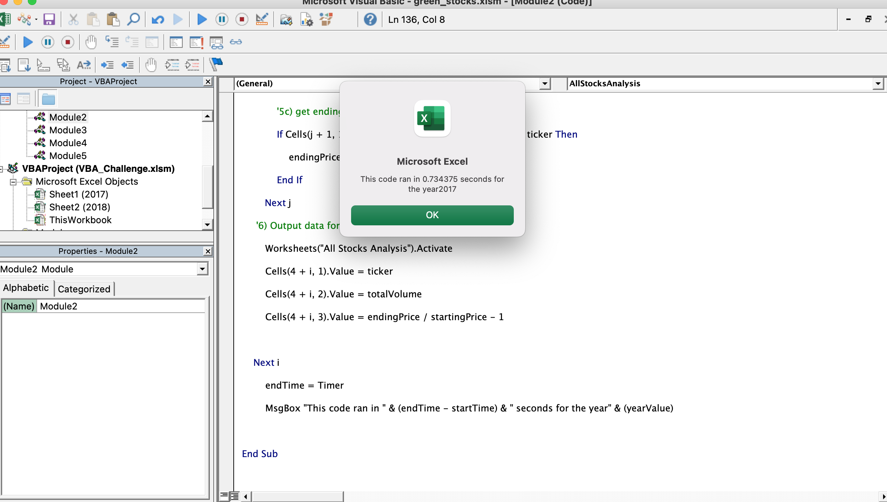
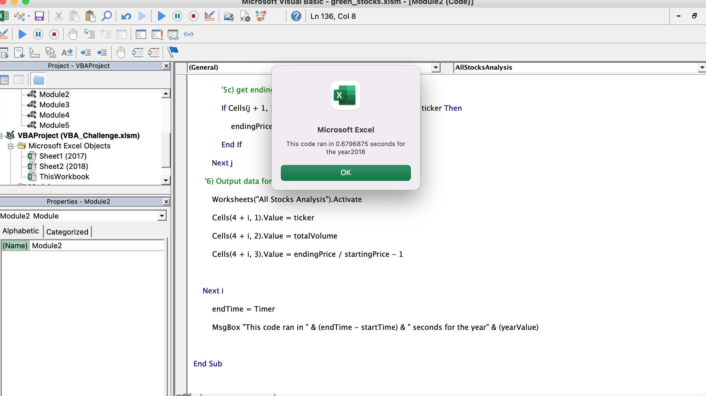

# Analysis of Green Energy Stocks

## Overview of Project
The project was an analysis of green stocks using data from the year 2017 and 2018.
### Purpose
The purpose of this project was to provide a real-time analysis of several green enery stocks using data from the year 2017 and 2018, and to make a user-friendly macro for users to easily access this information without having prior knowledge of VBA coding.
## Results
### Stock Performance 
### Execution Times
The execution times of the original script are as follows:
### 2017

### 2018 

## Summary

