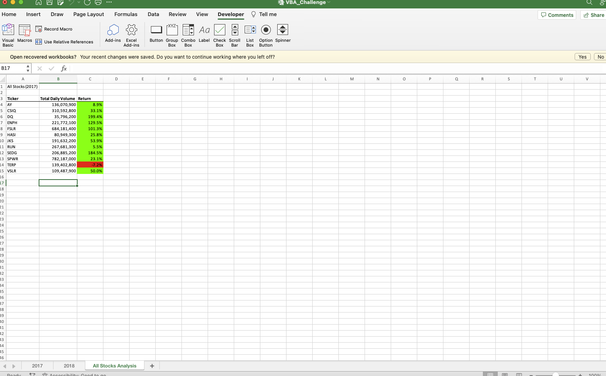
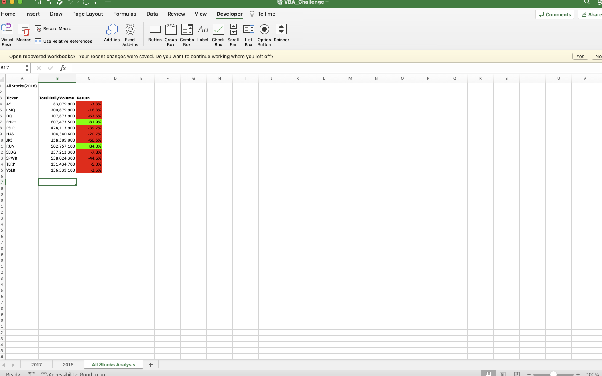
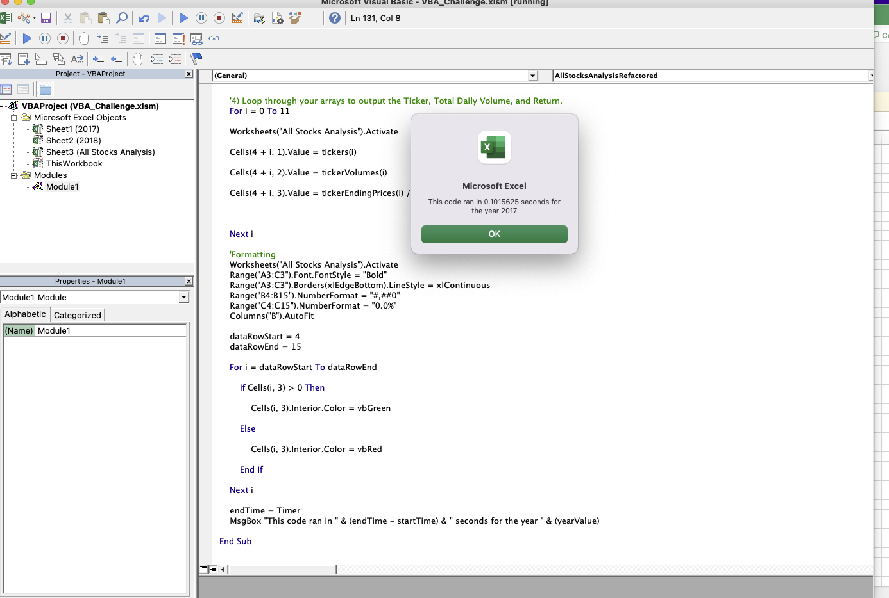
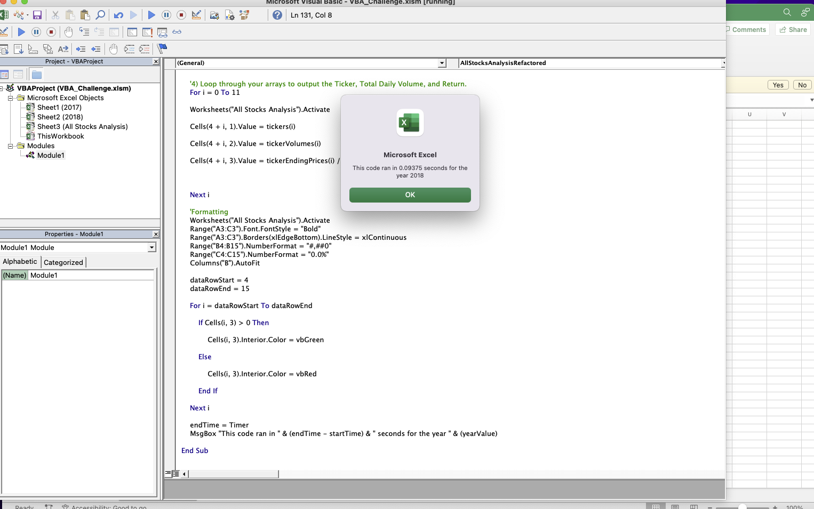

# Analysis of Green Energy Stocks

## Overview of Project
The project was an analysis of green stocks using data from the year 2017 and 2018.
### Purpose
The purpose of this project was to provide a real-time analysis of several green enery stocks using data from the year 2017 and 2018, and to make a user-friendly macro for users to easily access this information without having prior knowledge of VBA coding.
## Results
### Stock Performance 
The 2017 stock performances were as follows:

The 2018 stock performances were as follows:

### Execution Times
The original script ran at 0.734375 seconds for the Year 2017 and at 0.6796875 seconds for the Year 2018. The refactored script ran at 0.1015625 seconds for Year 2017 and 0.09375 seconds for Year 2018. As you can see, the refactored script runs much faster and more efficient than the original.
2017 Original:

2017 Refactored:

2018 Original:

2018 Refactored:

## Summary
The advantage of refactoring code is that you can decrease the run time of the macro and make it more efficient. This allows for quicker processing speeds. The disadvantage of refactoring code can be human error in the code that is not detected. For example, many times this script would still run without all the proper contents in the code. In This scenario, the pros of refactoring the code were clear in that the run times for the macro improved from 0.734375 seconds to 0.1015625 seconds and 0.6796875 seconds to 0.09375 seconds. The cons are that if say the data in the Data Analysis table was inaccurate, the code would still run and appear just as fast.  
